<h1 align="center">Лабораторна робота №9</h1>
<h3 align="center">Advanced Encryption Standard (AES)<br>Власні реалізації AES, вісім режимів шифрування та програма AES Studio</h3>

<p align="center">
  <a href="https://github.com/RE22GDV/LR9-AES/actions/workflows/ci.yml"></a>
  
  
  
  
</p>

> Дисципліна: Захист даних · Тема: блочні шифри, режими шифрування, автентифіковане шифрування
> Основна частина — Python (AES з нуля, усі режими, програма з інтерфейсом, експерименти); C# — проста програма AES-CTR

ECB видає однакові блоки для однакових даних, а CBC, CFB, OFB, CTR і CTS не помічають змін шифротексту. Серед порівняних режимів зміну виявляє лише GCM.

---

## Зміст

1. [Мета та постановка задачі](#1-мета-та-постановка-задачі)
2. [Математична модель](#2-математична-модель)
3. [Реалізації](#3-реалізації)
4. [Програма AES Studio](#4-програма-aes-studio)
5. [Структура репозиторію](#5-структура-репозиторію)
6. [Швидкий старт](#6-швидкий-старт)
7. [Верифікація](#7-верифікація)
8. [Порівняння режимів](#8-порівняння-режимів)
9. [Висновки](#9-висновки)
10. [Відтворення результатів](#10-відтворення-результатів)
11. [Список використаних джерел](#11-список-використаних-джерел)

---

## 1. Мета та постановка задачі

У завданні наведено приклад AES у режимі CBC на C# і поставлено задачу:
реалізувати AES в іншому режимі шифрування, з зашифруванням і
розшифруванням, і розмістити код на GitHub. Перелічено режими ECB, CBC,
CFB, OFB, CTR і CTS.

Робота виконує завдання з запасом:

| Що зроблено | Де |
|---|---|
| AES-128/192/256 з нуля за FIPS-197: еталонна й таблична реалізації | [`src/aeslab/aes.py`](src/aeslab/aes.py), [`aes_fast.py`](src/aeslab/aes_fast.py) |
| Режими ECB, CBC, CFB-8, CFB-128, OFB, CTR, CTS і автентифікований GCM | [`src/aeslab/modes.py`](src/aeslab/modes.py) |
| Програма з інтерфейсом AES Studio: текст, файли з паролем, наочна різниця режимів | [`src/aeslab/gui.py`](src/aeslab/gui.py) |
| Формат зашифрованих файлів: PBKDF2, тег GCM або HMAC-SHA256 | [`src/aeslab/container.py`](src/aeslab/container.py) |
| Проста програма на C#: AES-CTR поверх `System.Security.Cryptography.Aes` | [`solution/AesCtr.cs`](solution/AesCtr.cs) |
| Звірка з 31 офіційним вектором і з OpenSSL, 158 тестів | [`tests/`](tests) |
| Сім експериментів, що порівнюють режими | [`experiments/`](experiments) |

---

## 2. Математична модель

### Блочний шифр AES

AES шифрує блок зі 128 бітів, поданий як матриця стану 4 × 4 байти.
Кількість раундів `Nr` залежить від довжини ключа `Nk` у 32-бітових словах
([формула (1)](#formula-1)):

<a id="formula-1"></a>

$$
N_r = N_k + 6 \in \{10,\ 12,\ 14\}, \qquad
S_r = \mathrm{AddRoundKey}\big(\mathrm{MixColumns}(\mathrm{ShiftRows}(\mathrm{SubBytes}(S_{r-1}))),\ K_r\big) \qquad\text{(1)}
$$

В останньому раунді `MixColumns` немає. Усі обчислення ведуться в полі
GF(2⁸) з многочленом `m(x) = x⁸ + x⁴ + x³ + x + 1`. S-блок не вписано
таблицею, а обчислено з визначення: обернений елемент поля й афінне
перетворення ([формула (2)](#formula-2)):

<a id="formula-2"></a>

$$
S(a) = A \cdot a^{-1} \oplus \mathtt{63}_{16}, \qquad 0^{-1} := 0 \qquad\text{(2)}
$$

де `A` — фіксована двійкова матриця 8 × 8. `MixColumns` множить кожен
стовпець стану на матрицю над GF(2⁸) ([формула (3)](#formula-3)):

<a id="formula-3"></a>

$$
\begin{pmatrix} s'_0 \\ s'_1 \\ s'_2 \\ s'_3 \end{pmatrix} =
\begin{pmatrix} 2 & 3 & 1 & 1 \\ 1 & 2 & 3 & 1 \\ 1 & 1 & 2 & 3 \\ 3 & 1 & 1 & 2 \end{pmatrix}
\begin{pmatrix} s_0 \\ s_1 \\ s_2 \\ s_3 \end{pmatrix} \qquad\text{(3)}
$$

### Режими шифрування

Блочний шифр `E_K` обробляє рівно 16 байтів, тож для довших повідомлень
потрібен режим. Найпростіші режими задано [формулою (4)](#formula-4):

<a id="formula-4"></a>

$$
\text{ECB:}\ C_i = E_K(P_i), \qquad
\text{CBC:}\ C_i = E_K(P_i \oplus C_{i-1}),\ C_0 = IV \qquad\text{(4)}
$$

Режими зі зворотним зв'язком перетворюють блочний шифр на потоковий
([формула (5)](#formula-5)):

<a id="formula-5"></a>

$$
\text{CFB:}\ C_i = P_i \oplus E_K(C_{i-1}), \qquad
\text{OFB:}\ O_i = E_K(O_{i-1}),\ C_i = P_i \oplus O_i,\ O_0 = IV \qquad\text{(5)}
$$

У CTR ключовий потік залежить лише від номера блоку
([формула (6)](#formula-6)), тому блоки обробляються незалежно й у
будь-якому порядку:

<a id="formula-6"></a>

$$
C_i = P_i \oplus E_K\!\left((T_0 + i) \bmod 2^{128}\right) \qquad\text{(6)}
$$

CTS (варіант CBC-CS3, як у RFC 3962) обходиться без доповнення: останній
неповний блок «позичає» байти з попереднього шифроблоку, тож довжина
шифротексту дорівнює довжині тексту. ECB і CBC натомість доповнюють
повідомлення за PKCS#7 ([формула (7)](#formula-7)):

<a id="formula-7"></a>

$$
p = 16 - (n \bmod 16) \in [1, 16], \qquad |C| = n + p \qquad\text{(7)}
$$

### Автентифіковане шифрування GCM

GCM шифрує в режимі CTR і додатково обчислює тег автентичності над
шифротекстом `C` і додатковими даними `A` ([формула (8)](#formula-8)):

<a id="formula-8"></a>

$$
H = E_K(0^{128}), \qquad X_i = (X_{i-1} \oplus B_i) \cdot H \ \text{в}\ \mathrm{GF}(2^{128}), \qquad
T = E_K(J_0) \oplus \mathrm{GHASH}_H(A, C) \qquad\text{(8)}
$$

де `B_i` — блоки `A`, `C` і блок довжин, `J_0` — початковий лічильник
із 96-бітового nonce. Без ключа підробити тег практично неможливо, тож
змінений шифротекст відкидається ще до видачі тексту.

### Ключ із пароля

Програма шифрує файли паролем. Ключ виводиться функцією PBKDF2 із
випадковою сіллю й великою кількістю ітерацій ([формула (9)](#formula-9)),
щоб кожна спроба вгадати пароль коштувала дорого:

<a id="formula-9"></a>

$$
K \,\|\, K_{\text{MAC}} = \mathrm{PBKDF2}\big(\mathrm{HMAC\text{-}SHA256},\ \text{пароль},\ \text{сіль},\ c = 200\,000\big) \qquad\text{(9)}
$$

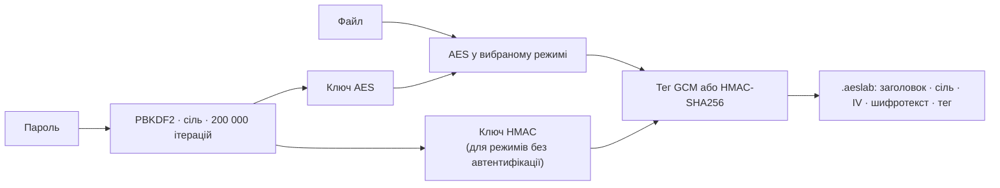

---

## 3. Реалізації

| Реалізація | Мова | Призначення |
|---|---|---|
| `AES` — еталонна | Python | крок у крок за FIPS-197, таблиці обчислюються з визначення; трасування раундів |
| `FastAES` — таблична | Python | раунд через чотири 32-бітові T-таблиці, розшифрування за еквівалентним оберненим шифром |
| `OpenSSLAES` — обгортка | Python | блок з OpenSSL (бібліотека `cryptography`) для звірки та порівняння швидкості |
| `AesCtr` | C# | режим CTR поверх `System.Security.Cryptography.Aes` |

Усі режими (`modes.py`) приймають будь-який об'єкт із методами
`encrypt_block` і `decrypt_block`. Тому ті самі функції CBC, CTR чи GCM
працюють і над власним AES, і над блоком OpenSSL.

Програма на C# повторює стиль прикладу із завдання, але в режимі CTR,
якого в .NET немає:

```csharp
using Aes aesObject = Aes.Create();
aesObject.Key = key;                      // 16, 24 or 32 bytes: AES-128/192/256
aesObject.Mode = CipherMode.ECB;          // raw AES block function; CTR is below
aesObject.Padding = PaddingMode.None;     // stream mode: no padding needed
...
aesObject.EncryptEcb(counter, keystream, PaddingMode.None);
output[offset + i] = (byte)(input[offset + i] ^ keystream[i]);
Increment(counter);                       // 128-bit big-endian, as in NIST SP 800-38A
```

Для порівняння програма шифрує той самий текст і вбудованим режимом
.NET `CipherMode.CFB`.

---

## 4. Програма AES Studio

```bash
python run.py gui
```

Програма написана на Tkinter, тож працює на чистому Python без
додаткових пакетів. У ній п'ять вкладок.

**Текст.** Можна обрати режим, довжину ключа й реалізацію AES, а ключ та
IV/nonce згенерувати. Результат показується в hex або Base64. Для ECB
програма попереджає, що однакові блоки видно, для режимів без
автентифікації — що цілісність не контролюється. Якщо той самий nonce
використати повторно з тим самим ключем у потоковому режимі, програма
теж попередить.

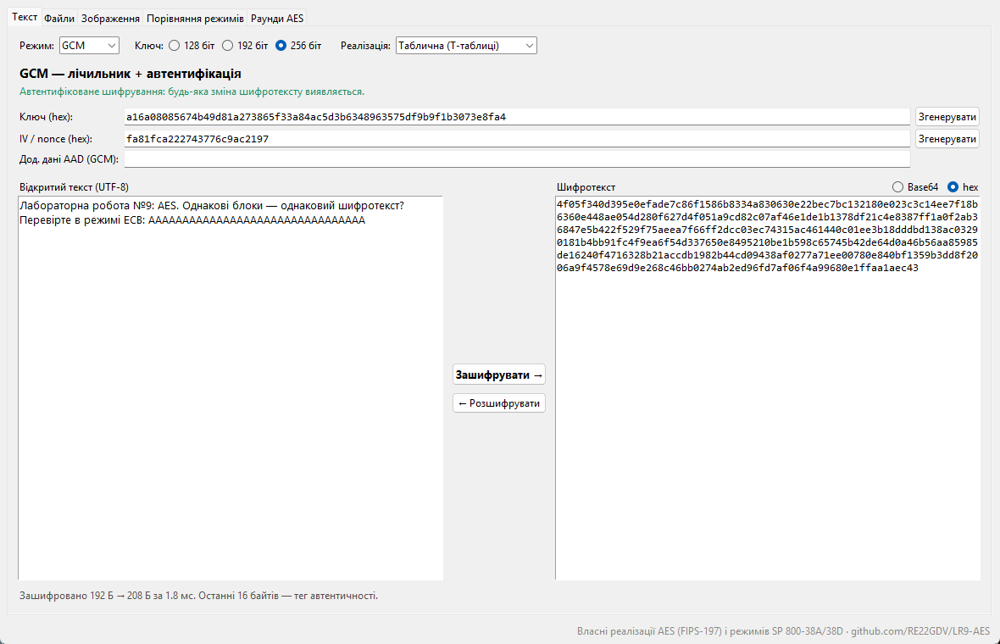

**Файли.** Файл шифрується паролем у формат `.aeslab`. Неправильний
пароль або будь-яка зміна файла виявляються: у GCM — тегом, в інших
режимах — HMAC-SHA256.

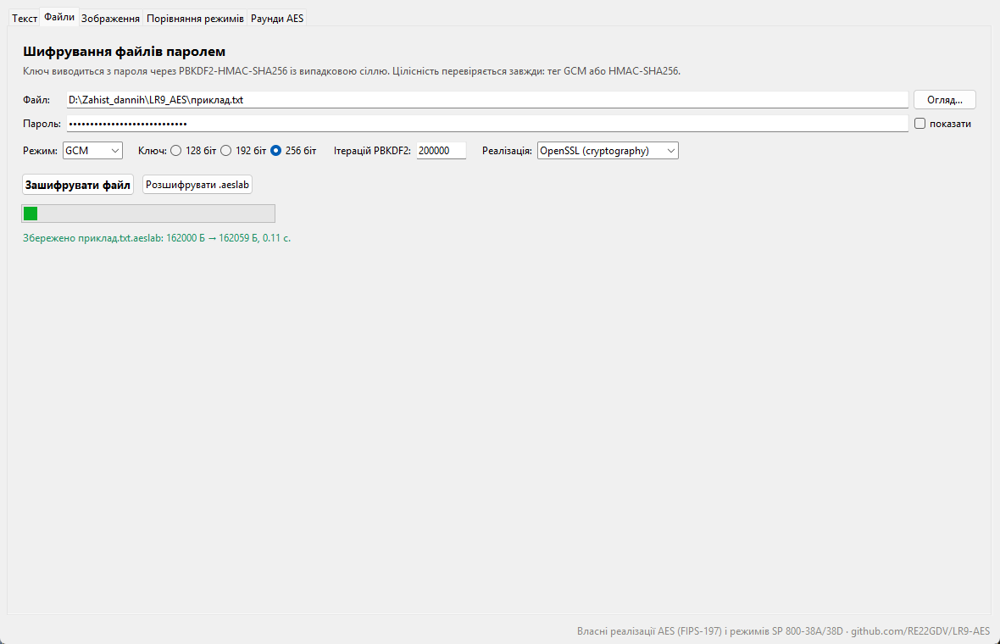

**Зображення.** Пікселі шифруються в обраному режимі. В ECB лишається
42 різні блоки з 4 608 — стільки ж, скільки в оригіналі, — тож контури
літер видно навіть у шифротексті.

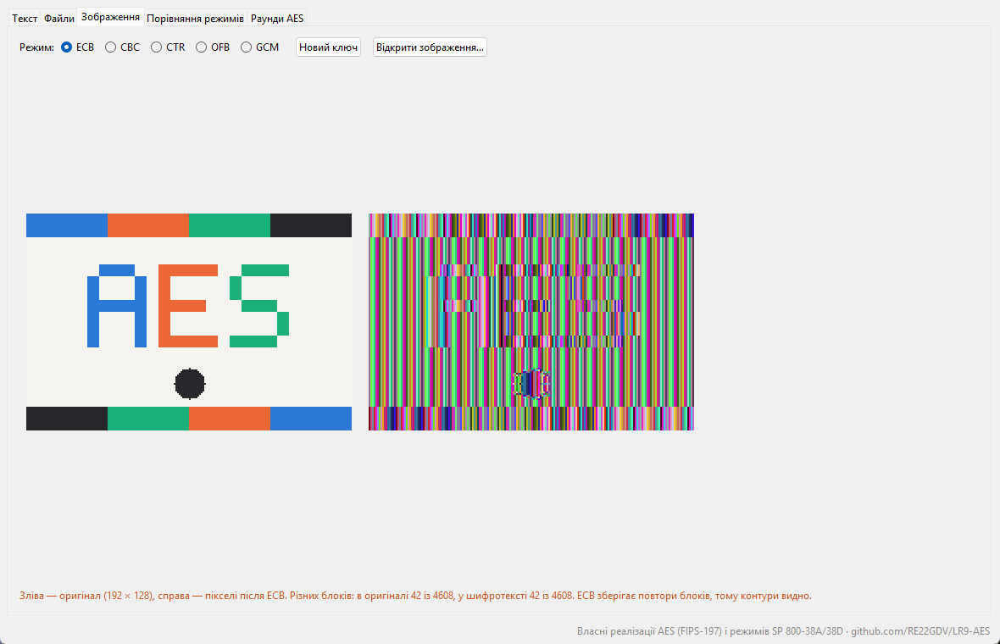

**Порівняння режимів.** Таблиця властивостей, швидкість на вашому
комп'ютері та наслідки інверсії одного біта шифротексту.

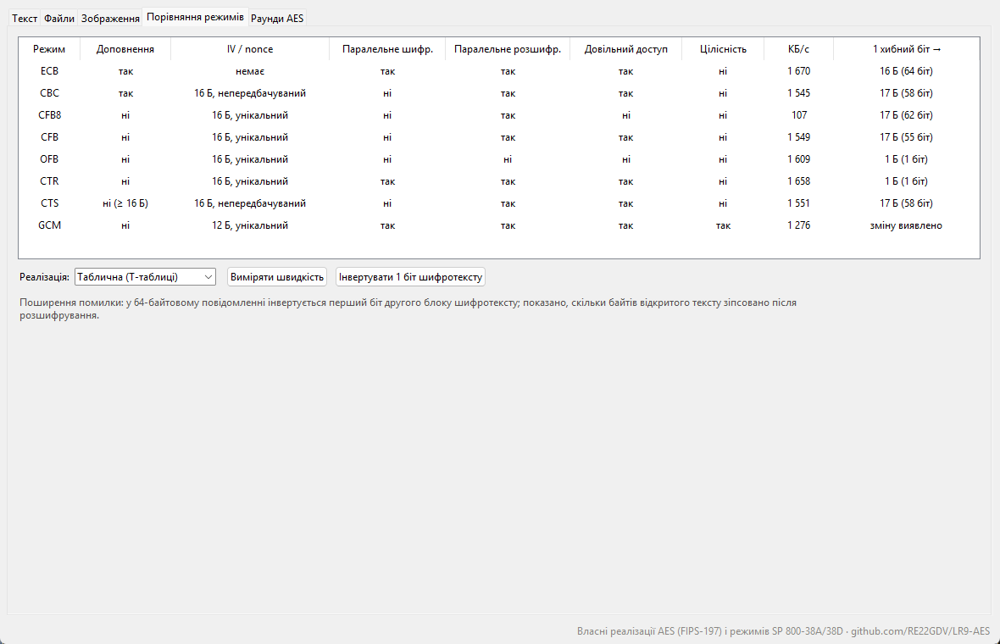

**Раунди AES.** Стан шифру після кожного раунду; підсвічено байти, які
змінилися після інверсії одного біта відкритого тексту.

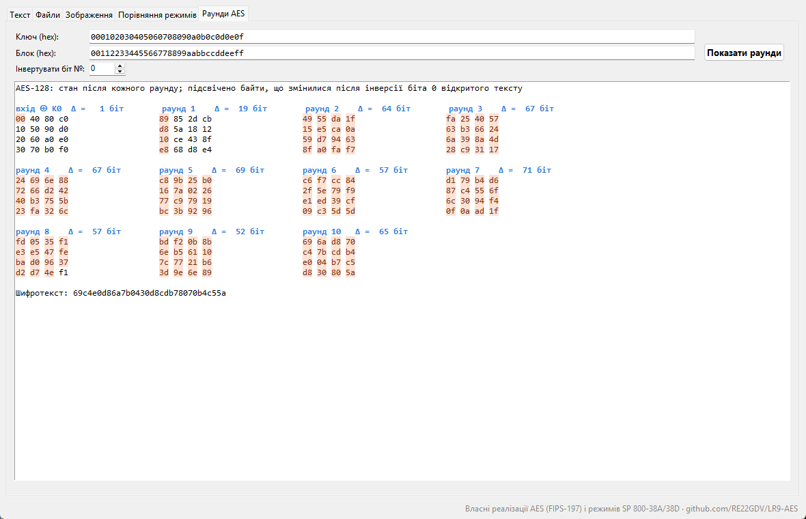

---

## 5. Структура репозиторію

```text
LR9-AES/
├── solution/AesCtr.cs             C#: AES-CTR поверх System.Security.Cryptography.Aes
├── csharp/AesCtrDemo/             Консольна програма C#: демонстрація, вектори NIST, швидкість
├── src/aeslab/
│   ├── aes.py                     Еталонний AES (FIPS-197), трасування раундів
│   ├── aes_fast.py                Табличний AES (T-таблиці)
│   ├── modes.py                   ECB, CBC, CFB-8/128, OFB, CTR, CTS, GCM; PKCS#7
│   ├── container.py               Формат .aeslab: PBKDF2, GCM або HMAC
│   ├── analysis.py                Порівняння режимів, лавинний ефект, поширення помилки
│   ├── backends.py                Вибір реалізації (власні або OpenSSL)
│   ├── demo_image.py              Демонстраційне зображення без Pillow
│   ├── gui.py                     Програма AES Studio
│   └── cli.py                     Командний рядок
├── tests/
│   ├── vectors.json               31 офіційний вектор: FIPS-197, SP 800-38A, GCM, RFC 3962
│   ├── test_aes.py                S-блок, розклад ключа, дві реалізації, OpenSSL
│   ├── test_modes.py              Вектори для кожної реалізації, зворотність, GCM
│   ├── test_container_analysis.py Файли .aeslab, поширення помилки, лавинний ефект
│   ├── test_cross_and_gui.py      C# проти Python, запуск інтерфейсу
│   └── test_results.py            Збережені результати проти коду
├── experiments/run_experiments.py Сім рисунків і зведення
├── docs/figures/, docs/results/   Рисунки, знімки програми, первинні дані
├── .github/workflows/ci.yml       Python 3.10–3.12 і .NET 8
└── run.py                         Запуск без встановлення пакета
```

AES, режими, формат файлів і програма не мають зовнішніх залежностей.
Бібліотека `cryptography` потрібна лише для звірки з OpenSSL, а
`matplotlib`, `numpy` і `pillow` — для рисунків і знімків вікна. Звіт у
форматах Word і PDF зберігається локально поза репозиторієм.

---

## 6. Швидкий старт

```bash
git clone https://github.com/RE22GDV/LR9-AES.git
cd LR9-AES
python run.py selftest
python run.py gui
```

```text
[OK] Еталонна (FIPS-197): 31 з 31 офіційних векторів
[OK] Таблична (T-таблиці): 31 з 31 офіційних векторів
[OK] OpenSSL (cryptography): 31 з 31 офіційних векторів
пройдено все
```

```bash
python run.py encrypt звіт.pdf --mode GCM          # пароль буде запитано
python run.py decrypt звіт.pdf.aeslab
dotnet run --project csharp/AesCtrDemo -- "мій текст"
```

---

## 7. Верифікація

Твердження «шифр працює» перевірено проти офіційних тестових векторів,
а не лише через зворотність шифрування й розшифрування.

| Джерело | Що перевіряє | Векторів |
|---|---|---:|
| FIPS-197, додаток C | сам блок AES-128/192/256 | 3 |
| NIST SP 800-38A, додаток F | ECB, CBC, CFB-8, CFB-128, OFB, CTR для трьох довжин ключа | 18 |
| McGrew, Viega (специфікація GCM) | GCM, зокрема з додатковими даними | 4 |
| RFC 3962, додаток B | CTS (CBC-CS3) для довжин 17–64 байти | 6 |

Усі 31 вектор проходять для кожної з трьох реалізацій блоку. Крім того,
тести звіряють режими з OpenSSL на 100 випадкових повідомленнях довжиною
0–69 байтів і перевіряють розклад ключа за додатком A FIPS-197, стан
після першого раунду за додатком C, властивості S-блоку й множення в
GF(2¹²⁸). Тест GCM інвертує біти шифротексту й тегу та змінює AAD або
nonce: жодна зміна не проходить.

Програма C# окремо проходить 9 векторів SP 800-38A для CTR (власна
реалізація) і CFB-8/CFB-128 (вбудовані в .NET), 1 000 випадкових
повідомлень і перехід лічильника `ff…ff → 00…00`. На випадкових даних
результат C# збігається з Python.

```bash
python -m pytest -q          # 158 тестів
dotnet run --project csharp/AesCtrDemo -- selftest
```

---

## 8. Порівняння режимів

Детерміновані досліди використовують зерно `20261009` і відтворюються
число в число, а час залежить від машини (Intel Core i9-14900K,
Python 3.12).

| Режим | Доповнення | IV / nonce | Паралельне шифр. | Паралельне розшифр. | Довільний доступ | Цілісність |
|---|---|---|---|---|---|---|
| ECB | так | немає | так | так | так | ні |
| CBC | так | 16 Б, непередбачуваний | ні | так | так | ні |
| CFB-8 | ні | 16 Б, унікальний | ні | так | ні | ні |
| CFB-128 | ні | 16 Б, унікальний | ні | так | так | ні |
| OFB | ні | 16 Б, унікальний | ні | ні | ні | ні |
| CTR | ні | 16 Б, унікальний | так | так | так | ні |
| CTS | ні (≥ 16 Б) | 16 Б, непередбачуваний | ні | так | так | ні |
| GCM | ні | 12 Б, унікальний | так | так | так | так |

### 8.1 ECB розкриває структуру даних

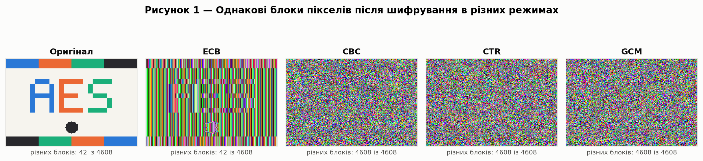

Демонстраційне зображення має 4 608 блоків по 16 байтів, але лише 42 з
них різні. В ECB однакові блоки пікселів дають однакові блоки
шифротексту, тож різних блоків так само 42 і контури зображення видно. У
CBC, CTR і GCM усі 4 608 блоків різні.

### 8.2 Лавинний ефект

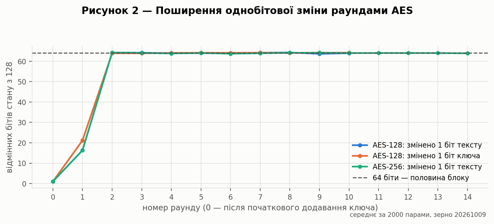

Для ідеального шифру зміна одного біта входу змінює кожен біт виходу з
імовірністю ½, тож кількість відмінних бітів має середнє й відхилення,
задані [формулою (10)](#formula-10):

<a id="formula-10"></a>

$$
\mathbb{E}[d_H] = 128 \cdot \tfrac{1}{2} = 64, \qquad \sigma = \sqrt{128 \cdot \tfrac{1}{4}} \approx 5{,}66 \qquad\text{(10)}
$$

Після першого раунду змінений біт зачіпає один стовпець стану: 4 байти,
у середньому 16,3 біта. Після другого раунду відмінних бітів уже
63,6–64,2 — практично 64. Зміна одного біта ключа дає після першого
раунду 21,2 біта, а далі так само близько 64. Середні обчислено за
2 000 парами.

### 8.3 Поширення помилки та виявлення змін

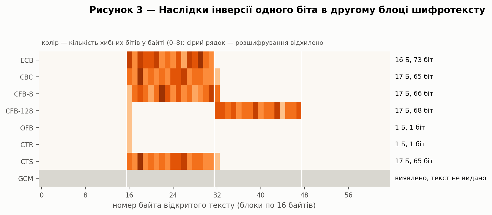

| Режим | Інверсія 1 біта шифротексту | Зміни виявлено |
|---|---|---:|
| ECB | 16 Б (весь блок) | 25,0 % |
| CBC | 17 Б: блок + 1 біт наступного | 49,8 % |
| CFB-8 | 17 Б: байт + 16 наступних | 0 % |
| CFB-128 | 17 Б: 1 біт + наступний блок | 0 % |
| OFB, CTR | 1 біт | 0 % |
| CTS | 17 Б | 0 % |
| GCM | відхилено, текст не видано | 100 % |
| CBC/CTR + HMAC (файли програми) | відхилено | 100 % |

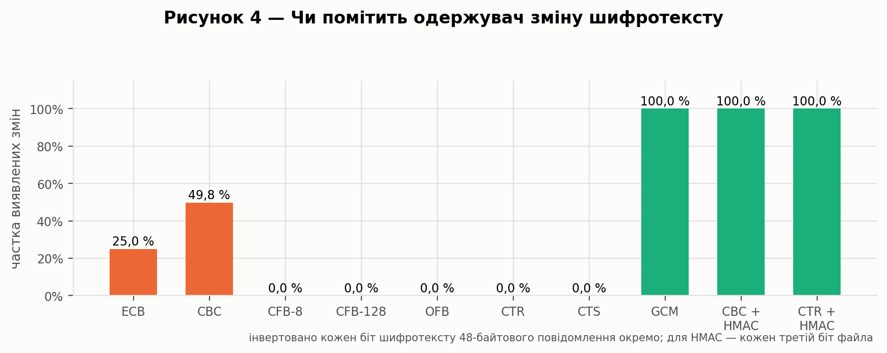

OFB і CTR не поширюють помилку, але саме тому зміна одного біта
шифротексту змінює рівно один біт відкритого тексту: одержувач цього не
помічає. «Виявлення» в ECB і CBC — побічний ефект перевірки доповнення:
спрацьовує лише, коли зміна зачіпає останні блоки. Це не захист
цілісності, і повідомляти про помилку доповнення назовні не можна.
Цілісність дають лише автентифіковані схеми: GCM або шифрування з
подальшим HMAC.

### 8.4 Накладні витрати на довжину

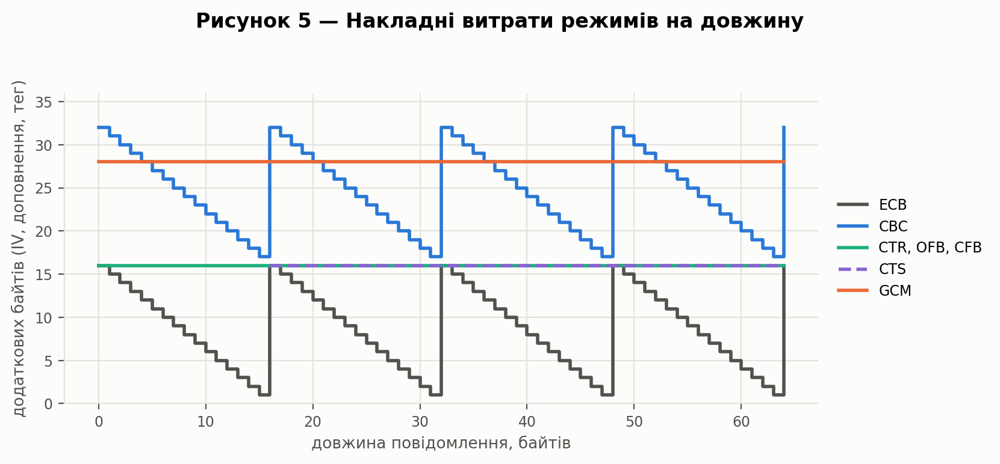

ECB доповнює повідомлення на 1–16 байтів; CBC додає ще 16 байтів IV.
Потокові режими CFB, OFB і CTR передають лише IV (16 байтів), а CTS — IV
без доповнення, але потребує щонайменше 16 байтів тексту. GCM додає
сталі 28 байтів: 12 байтів nonce і 16 байтів тегу.

### 8.5 Швидкість реалізацій

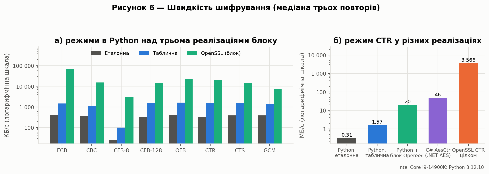

| Реалізація | ECB | CBC | CTR | GCM |
|---|---:|---:|---:|---:|
| Python, еталонна | 418 КБ/с | 361 КБ/с | 318 КБ/с | 385 КБ/с |
| Python, таблична | 1 468 КБ/с | 1 123 КБ/с | 1 608 КБ/с | 1 430 КБ/с |
| Python-режими + блок OpenSSL | 70 264 КБ/с | 15 558 КБ/с | 20 377 КБ/с | 7 209 КБ/с |

Таблична реалізація швидша за еталонну в 3–5 разів. CFB-8 виконує
16 шифрувань блоку на кожні 16 байтів замість одного, тож у власних
реалізаціях він приблизно в 15 разів повільніший за CFB-128. Для
табличної реалізації AES-192 і AES-256 повільніші за AES-128 в 1,11 і
1,31 раза — дещо менше за відношення кількості раундів (1,2 і 1,4), бо
частина часу припадає на сам режим. Режим CTR цілком у OpenSSL обробляє
3 566 МБ/с, C#-програма AesCtr — 46,5 МБ/с: її сповільнює окремий виклик
`EncryptEcb` на кожен блок. Це порівняння конкретних реалізацій на одній
машині.

### 8.6 Паралельність

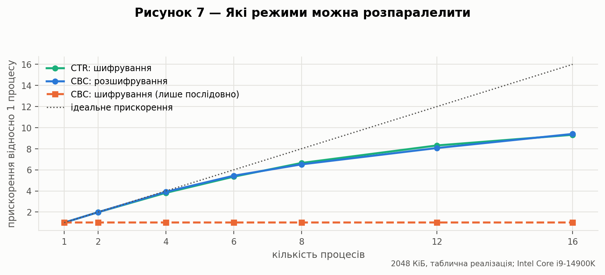

Прискорення визначено як `S(p) = T₁ / Tₚ`. 2 МіБ даних ділилися між
процесами, а кожен процес шифрував свою частину. Для шифрування CTR на
16 процесах прискорення становило 9,3×, для розшифрування CBC — 9,4×.
Шифрування CBC розпаралелити неможливо: кожен блок залежить від
попереднього шифроблоку. Для стабільності кожну точку виміряно п'ять
разів із чергуванням порядку режимів і взято мінімум. Перший прогін
після створення процесів був повільнішим, і без прогріву CTR хибно
виглядав гірше за CBC.

---

## 9. Висновки

Реалізовано блочний шифр AES-128/192/256 мовою Python у двох незалежних
варіантах — еталонному за FIPS-197 і табличному — та вісім режимів:
ECB, CBC, CFB-8, CFB-128, OFB, CTR, CTS і GCM. Усі реалізації проходять
31 офіційний тестовий вектор і збігаються з OpenSSL. Проста програма на
C# реалізує режим CTR, якого немає в .NET, поверх стандартного класу
`Aes` і також проходить вектори NIST.

Створено програму AES Studio з графічним інтерфейсом. Вона шифрує текст
і файли, показує наочну різницю між режимами на зображенні, порівнює
режими й відображає стан AES після кожного раунду. Файли захищено
паролем через PBKDF2, а цілісність перевіряється завжди: тегом GCM або
HMAC-SHA256.

Порівняння режимів показало, що ECB зберігає структуру даних: у
демонстраційному зображенні лишилися ті самі 42 різні блоки з 4 608.
Режими розрізняються поширенням помилки: від одного біта в OFB і CTR до
17 байтів у CBC, CFB і CTS. Лише GCM із розглянутих режимів виявляє
зміну шифротексту; поєднання CBC або CTR з HMAC також виявило всі
перевірені зміни. Лавинний ефект AES досягає ідеальних 64 бітів уже після
двох раундів.

Режими відрізняються й практично. CTR і розшифрування CBC прискорюються
приблизно вдев'ятеро на 16 процесах, а шифрування CBC лишається
послідовним. CFB-8 у власних реалізаціях приблизно в 15 разів
повільніший за CFB-128, а GCM додає до повідомлення 28 байтів. Тому для нових систем доречне
автентифіковане шифрування, наприклад GCM, з унікальним nonce для
кожного повідомлення.

---

## 10. Відтворення результатів

```bash
python -m pip install -r requirements.txt
python -m pytest -q
python experiments/run_experiments.py
python run.py gui --screenshot docs/figures     # знімки вкладок програми (Windows, macOS)
```

Програма записує всі величини в `docs/results/experiments.json`, оновлює
`summary.md` і рисунки. Рисунки з заголовками лежать у `docs/figures/`,
без заголовків — у `docs/figures/pdf/`. Для швидкості C#-програми:

```bash
dotnet run -c Release --project csharp/AesCtrDemo -- bench
```

---

## 11. Список використаних джерел

1. NIST FIPS 197. Advanced Encryption Standard (AES). – 2001, оновлення 2023. – Режим доступу: https://csrc.nist.gov/pubs/fips/197/final

2. Dworkin M. NIST SP 800-38A. Recommendation for Block Cipher Modes of Operation: Methods and Techniques. – 2001. – Режим доступу: https://csrc.nist.gov/pubs/sp/800/38/a/final

3. Dworkin M. NIST SP 800-38A Addendum. Three Variants of Ciphertext Stealing for CBC Mode. – 2010. – Режим доступу: https://csrc.nist.gov/pubs/sp/800/38/a/addendum/final

4. Dworkin M. NIST SP 800-38D. Recommendation for Block Cipher Modes of Operation: Galois/Counter Mode (GCM) and GMAC. – 2007. – Режим доступу: https://csrc.nist.gov/pubs/sp/800/38/d/final

5. McGrew D., Viega J. The Galois/Counter Mode of Operation (GCM). – 2005.

6. Raeburn K. Advanced Encryption Standard (AES) Encryption for Kerberos 5. – RFC 3962, 2005. – Режим доступу: https://www.rfc-editor.org/rfc/rfc3962

7. Moriarty K., Kaliski B., Rusch A. PKCS #5: Password-Based Cryptography Specification Version 2.1. – RFC 8018, 2017. – Режим доступу: https://www.rfc-editor.org/rfc/rfc8018

8. C# Corner. Introduction to Symmetric Encryption [Електронний ресурс]. – Режим доступу: https://www.c-sharpcorner.com/article/introduction-to-symetric-engryption/

9. Вихідний код та результати роботи [Електронний ресурс]. – Режим доступу: https://github.com/RE22GDV/LR9-AES

---

<p align="center"><sub>Лабораторна робота №9 · Захист даних · 2026</sub></p>
